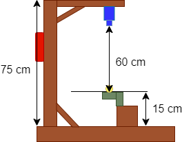
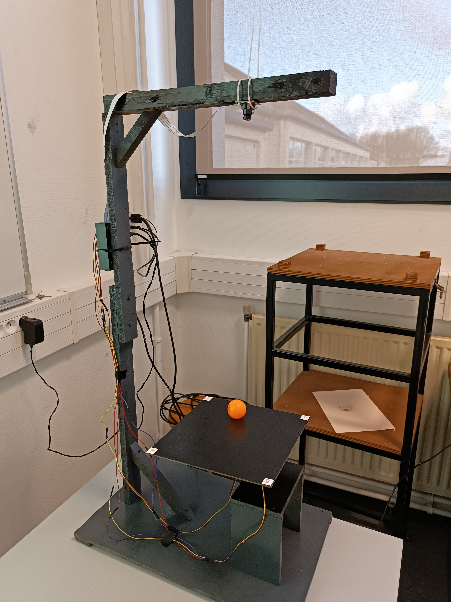
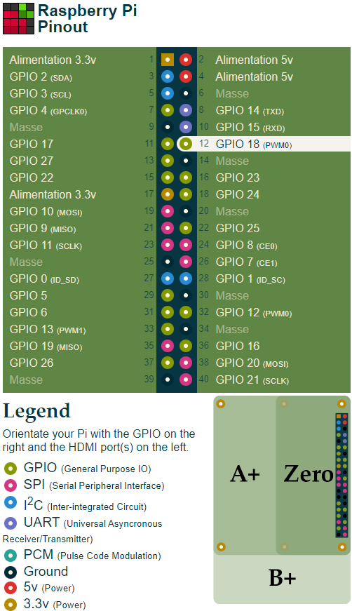

# Plan de la maquette

Schéma Maquette :

Photo Maquette :

La maquette est composée de :

    - Planche de bois récupérées
    - Raspberry Pi 4
    - Caméra Raspberry
    - 2 Servomoteurs (Un pour chaque degre de liberté)
    - Fils électriques

La Raspberry ainsi que la caméra sont accrochées sur le support à l'aide de serflexs. La caméra et le Raspberry sont relié par un flex. La résolution de la caméra est de 640x480 pixels.

Pour les servomoteurs, le servomoteur contrôlent l'axe X est fixé au support et le servomoteur contrôlent l'axe Y est fixé au servomoteur X et à la planche.
De plus il est précisé dans la documentation des servomoteurs HITEC que le fils noir correspond au 'ground', le fils rouge correspond au 'power' et le fils jaune correspond au 'signal'.

Photo GPIO RASPBERRY :

Les fils rouges des servomoteurs sont donc connectés au pin 2 et 4 qui sont réliées à  l'alimentation 5V. Les fils noires des servomoteurs sont donc connectés au pin 6 et 14 qui sont réliées a la masse. Les fils jaunes des servomoteurs sont donc connectés au pin 12 et 33 qui sont réliées aux GPIO associé au PWM0(GPIO 18) et PWM1(GPIO 13). Le GPIO 13 est associé au servomoteur qui contrôle l'axe X. Le GPIO 18 est associé au servomoteur qui contrôle l'axe Y. 

La planche pour asservir la balle est de taille 25cm x 25cm.

La balle a asservir est une balle de ping pong de couleur jaune orangée.

Les 4 coins de la planche sont de couleurs blanches pour ce démarquer de la couleur noir de la planche.

La distance entre la caméra et la planche doit être au minimum de 60 cm pour permettre à la caméra de voir l'entièreté de la planche. Cette distance augmente en fonction de la taille de la planche. De même une surélévation des servomoteurs est nécéssaire pour éviter des contacts entre la planche et le support.