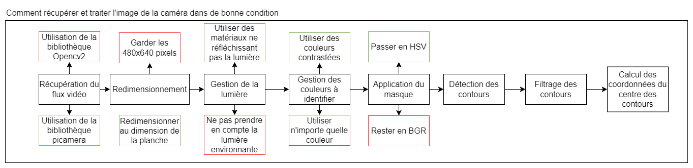
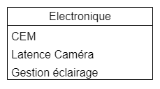
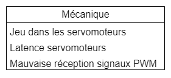
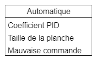
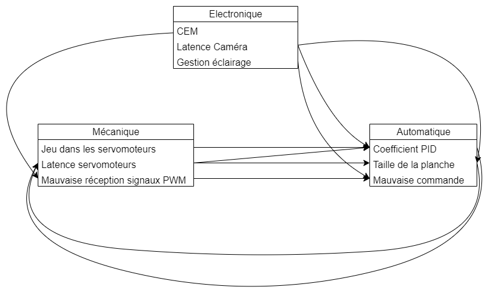

# Spécification

## Matériel
### Caméra

Tout d'abord, il faut récupérer le flux vidéo de la caméra. Pour cela, il faut utiliser des bibliothèques permettant de récupérer les données de la caméra. Sur Raspberry Pi, 2 bibliothèques s'offre à nous. La première est la **picamera**, qui est une bibliothèque de Raspberry. La seconde est la **OpenCV**, qui est aussi la librarie utiliser lors du traitement future de l'image. Les principales différences entre lors de l'utilisation de ces 2 bibliothèques sont la latence et la qualité vidéo. 

| Biblothèque   | Latence       | Qualité  |
| ------------- |:-------------:| -----:|
| OpenCV        | 1 seconde     | Bonne |
| picamera      | 0,5 seconde   |   Assez bonne |

Pour la suite la différence de qualité entre les deux bibliothèques n'impacte pas sur le traitement de l'image. Cependant, la latence impacte grandement lors de l'asservissement pour donner la bonne commande aux servomoteurs. Il est donc fortement conseiller d'utiliser une bibliothèque qui permet d'obtenir le moins de latence possible, et donc d'utiliser la bibliothèque **picamera**.

Ensuite il faut savoir si on redimmensionne la résolution de l'image reçue. En effet la résolution de l'image est de 640x480 pixels, ce qui implique que l'image récupérer ne récupére pas juste la planche qui asservie mais aussi en partie l'environnement autour de celles-ci. Or cette enviromment peut comporter des pixels de couleurs qui pourrait impacter la mise en place future des masques. Il est donc important de savoir si on redimensionne la résolution de l'image. Si l'environnement proche de la maquette est connue et ne change pas alors redimensionner l'image ne parait pas important car les couleurs présent sur l'image sont connues. Par contre si la maquette est voué à changer d'environnement, alors il est préférable de redimensionner l'image.

Par la suite, il faut gérer la lumière environnante. Il est important de gérer la lumière lorsqu'on fait du traitement d'image avec une caméra car la qualité de l'image peut être grandement affectée par les conditions d'éclairage.\
La quantité de lumière qui atteint la caméra peut affecter la luminosité de l'image, ce qui peut rendre l'image trop sombre ou trop claire. Un éclairage inadéquat peut également créer des ombres indésirables, des reflets ou des distorsions de couleurs.\
De plus, la qualité de la lumière, comme sa température de couleur et sa direction, peut également affecter l'apparence de l'image. Par exemple, une lumière chaude peut donner une apparence plus chaleureuse à une scène, tandis qu'une lumière froide peut donner une apparence plus froide.\
En gérant la lumière de manière appropriée, on peut donc améliorer la qualité de l'image et s'assurer que les couleurs et les détails de l'image sont fidèles à la réalité. Cela peut se faire en utilisant des filtres, en utilisant des matériaux ne réfléchissant pas la lumière ou en utilisant des sources de lumière supplémentaires pour améliorer les conditions d'éclairage.

Ensuite il faut faire une bonne gestion des couleurs. C'est a dire utiliser des couleurs contrastées. Cela permet de faciliter la mise en place des masques et donc de faciliter le traitement de l'image par la suite. 

Pour l'applications du masque sur l'image reçue, il est possible de définir le masque en BGR ou en HSV. \
Passer en espace de couleur HSV (ou Teinte Saturation Luminosité) est souvent utilisé pour extraire une couleur spécifique d'une image car cet espace de couleur permet de séparer plus facilement la couleur du reste de l'image.\
Contrairement à l'espace de couleur RGB (Rouge Vert Bleu) où chaque pixel est décrit par ses valeurs en rouge, vert et bleu, l'espace de couleur HSV sépare la couleur en trois dimensions : la teinte, la saturation et la luminosité.\
La teinte représente la couleur elle-même, telle que le rouge, le bleu ou le jaune, et est exprimée en degrés. La saturation mesure l'intensité de la couleur, allant du gris à la couleur pure, tandis que la luminosité mesure la quantité de lumière présente dans la couleur, allant du noir au blanc.\
En utilisant l'espace de couleur HSV, on peut extraire facilement une couleur spécifique en fixant une plage de teinte et de saturation. On peut ainsi isoler une plage de couleurs et en extraire les pixels correspondants, ce qui est utile pour effectuer des tâches telles que la segmentation d'image ou la détection d'objets, comme la balle dans notre cas.\
L'espace de couleur HSV est également plus intuitif pour la perception humaine de la couleur, car il se rapproche de la façon dont nous percevons les couleurs dans la vie réelle. Ainsi, en utilisant l'espace de couleur HSV, il est plus facile de sélectionner et d'extraire une couleur spécifique dans l'image pour faire la détection de contours.

Il faut ensuite effectuer une simple détection de contours pour récupérer les zones de couleurs voulu. Pour cela, il faut utiliser la bibliothèque **OpenCV**. 

Puis il est nécessaire de filter les contours pour ne garder que ceux d'une certaine taille minimum. Cela permet de ne garder que les contours qui sont réellement important et recherchés.

Et pour finir il faut calculer les coordonnées des contours. Ce sont ces coordonnées qui seront utiliser pour détecter la planche et la balle.

## Electronique

### Latence Caméra
La latence de la caméra peut être un problème important lors de de l'asservissement, car elle peut entraîner un retard dans la prise de décision et rendre l'asservissement instable ou imprécis. Il existe plusieurs techniques pour parer à la latence de la caméra lors d'un asservissement :

- Réduire la résolution de l'image : La réduction de la résolution de l'image peut aider à réduire la latence de la caméra, car elle permet de réduire la quantité de données qui doivent être traitées à chaque cycle d'asservissement.

- Augmenter la fréquence d'acquisition de l'image : En augmentant la fréquence d'acquisition de l'image, on peut réduire la latence de la caméra, car les images sont prises plus fréquemment, ce qui permet de réduire le délai entre l'acquisition de l'image et l'action de l'asservissement.

- Utiliser des caméras à faible latence : Les caméras à faible latence sont spécialement conçues pour minimiser la latence et peuvent donc être utilisées pour réduire les retards dans l'asservissement.

- Utiliser des algorithmes de prédiction : Les algorithmes de prédiction peuvent être utilisés pour estimer la position ou la trajectoire d'un objet à partir d'images précédentes, ce qui peut aider à compenser la latence de la caméra et à réduire les retards dans l'asservissement.

### Gestion de la lumière
La gestion de la lumière peut également avoir un impact sur l'asservissement, en particulier si l'asservissement utilise des informations visuelles pour prendre des décisions.

Si les conditions d'éclairage sont inadéquates ou instables, cela peut affecter la qualité de l'image et rendre plus difficile la détection des objets ou la reconnaissance de formes. Par exemple, des ombres ou des reflets indésirables peuvent apparaître sur l'image, ce qui peut rendre plus difficile l'identification des objets.

En outre, si la luminosité de l'image change rapidement, cela peut causer des problèmes de réglage de la caméra ou de la sensibilité du capteur, ce qui peut affecter la précision de l'asservissement.

Pour minimiser l'impact de la gestion de la lumière sur l'asservissement, il est important de s'assurer que les conditions d'éclairage sont stables et suffisantes pour permettre une détection précise des objets. Cela peut inclure l'utilisation de sources de lumière supplémentaires pour améliorer les conditions d'éclairage, ainsi que l'utilisation de filtres pour réduire les effets indésirables de la lumière ambiante.

### CEM
La CEM (compatibilité électromagnétique) peut avoir un impact important sur l'asservissement avec des servomoteurs, car elle peut perturber le signal de commande et entraîner des erreurs de positionnement ou des dysfonctionnements du système.

Les perturbations électromagnétiques peuvent être causées par des interférences électromagnétiques (EMI) provenant d'autres équipements électroniques à proximité ou par des rayonnements électromagnétiques externes, tels que ceux générés par les stations de radio, les antennes de téléphonie mobile ou les lignes électriques à haute tension. Dans notre cas c'est l'allumage des néons au tableau qui est la principal source de perturbations électromagnétiques.

Pour minimiser l'impact de la CEM sur l'asservissement avec des servomoteurs, il est important de prendre les mesures suivantes :

- Utiliser des câbles blindés : Les câbles blindés peuvent aider à réduire les perturbations électromagnétiques en fournissant une barrière physique pour empêcher les signaux électromagnétiques externes d'interférer avec les signaux de commande.

- Utiliser des filtres EMI : Les filtres EMI peuvent être utilisés pour réduire les interférences électromagnétiques en éliminant les fréquences indésirables du signal de commande.

- Utiliser des servomoteurs à faible bruit : Les servomoteurs à faible bruit sont conçus pour minimiser les perturbations électromagnétiques et peuvent donc être utilisés pour réduire l'impact de la CEM sur l'asservissement.

- Éloigner les équipements électroniques : Il est important d'éloigner les équipements électroniques sensibles, tels que les contrôleurs de servomoteurs et les capteurs, des sources potentielles de perturbations électromagnétiques, telles que les moteurs électriques et les circuits de puissance.

- Éviter les zones à forte CEM : Éviter les zones à forte CEM, telles que celles situées à proximité de grandes lignes électriques ou de stations de radio, peut aider à réduire l'impact de la CEM sur l'asservissement.

En prenant ces mesures, il est possible de minimiser l'impact de la CEM sur l'asservissement avec des servomoteurs et de garantir le bon fonctionnement du système.

## Mécanique

### Latence des servomoteurs
La latence des servomoteurs peut avoir un impact important sur l'asservissement, car elle peut affecter la précision et la stabilité du système. La latence est le temps nécessaire pour que le servomoteur se déplace d'une position à une autre en réponse à une commande de positionnement.

Lorsqu'il y a une latence dans le système, cela signifie que le servomoteur ne peut pas suivre les changements de consigne rapidement et avec précision, ce qui peut causer des erreurs de positionnement, des oscillations indésirables et une instabilité du système.

Pour minimiser l'impact de la latence des servomoteurs sur l'asservissement, il est important de prendre les mesures suivantes :

- Utiliser des servomoteurs à faible latence : Les servomoteurs à faible latence sont conçus pour minimiser le temps de réponse et peuvent être utilisés pour améliorer la précision et la stabilité du système.

- Utiliser des commandes de positionnement précises : Les commandes de positionnement précises peuvent aider à minimiser les erreurs de positionnement et à réduire la latence en fournissant une consigne plus précise au servomoteur.

- Optimiser les paramètres de l'asservissement : Les paramètres de l'asservissement, tels que le PID, doit être optimisé pour garantir une réponse rapide et précise du servomoteur.

En prenant ces mesures, il est possible de minimiser l'impact de la latence des servomoteurs sur l'asservissement et d'améliorer la précision et la stabilité du système.

### Jeu dans les servomoteurs
Le jeu au niveau des servomoteurs peut avoir un impact négatif sur l'asservissement en affectant la précision et la stabilité du système. Le jeu se produit au niveau du servomoteur X soit l'axe X, c'est à dire le servomoteur qui est positionner entre la planche et le servomoteur Y.

Lorsqu'il y a un jeu dans le système, cela peut causer des oscillations indésirables, des erreurs de positionnement et une instabilité du système.

Pour minimiser l'impact du jeu sur l'asservissement, il est important de prendre les mesures suivantes :

- Utiliser des servomoteurs avec un faible jeu : Les servomoteurs avec un faible jeu mécanique peuvent être utilisés pour minimiser les erreurs de positionnement et améliorer la précision et la stabilité du système.

- Utiliser des réducteurs de jeu : Les réducteurs de jeu peuvent être utilisés pour éliminer le jeu mécanique en fournissant une liaison mécanique rigide entre les différents éléments du système.

- Utilisation de 3 servomoteurs à la place de 2 servomoteurs: l'utilisation de trois servomoteurs offre des avantages en termes de précision, de stabilité et de redondance par rapport à l'utilisation de deux servomoteurs. Surtout cela permet de ne pas avoir de ne pas avoir de servomoteurs directement reliés entre eux.

En prenant ces mesures, il est possible de minimiser l'impact du jeu sur l'asservissement et d'améliorer la précision et la stabilité du système.

### Mauvaise réception de signaux PWM
Lorsqu'un servomoteur reçoit des signaux PWM (Pulse Width Modulation) incorrects lors de l'asservissement, cela peut avoir plusieurs impacts sur le fonctionnement du servomoteur et du système dans lequel il est utilisé.

Voici quelques-uns des impacts possibles de la réception de mauvais signaux PWM lors de l'asservissement avec un servomoteur :

- Mouvements imprévisibles : Si le servomoteur reçoit des signaux PWM incorrects, il peut effectuer des mouvements imprévisibles, qui peuvent entraîner des erreurs de positionnement ou de mouvement.

- Bruit et vibrations : Des signaux PWM incorrects peuvent également causer des bruits et des vibrations dans le système, ce qui peut affecter la précision et la stabilité de l'asservissement.

## Automatique

### Coefficient PID
Les coefficients du PID (Proportional-Integral-Derivative) sont des paramètres importants dans la conception d'un asservissement. Chacun de ces coefficients (P, I, D) contrôle une partie du comportement de l'asservissement et a un impact sur sa performance.

Voici les impacts des coefficients du PID lors de l'asservissement :

- Précision de l'asservissement : Les coefficients du PID ont un impact direct sur la précision de l'asservissement. Le coefficient P contrôle la réponse proportionnelle à l'erreur de mesure, le coefficient I ajoute une correction proportionnelle à l'erreur cumulée, et le coefficient D ajoute une correction proportionnelle à la dérivée de l'erreur. Les coefficients doivent être bien réglés pour obtenir une réponse précise de l'asservissement.

- Temps de réponse : Les coefficients du PID influencent également le temps de réponse de l'asservissement, c'est-à-dire le temps nécessaire pour que le système atteigne la consigne. Un coefficient P plus élevé entraîne une réponse plus rapide, mais peut également provoquer des oscillations. Les coefficients I et D ont également un impact sur le temps de réponse, mais dans une moindre mesure.

- Stabilité de l'asservissement : Les coefficients du PID ont également un impact sur la stabilité de l'asservissement. Un mauvais réglage des coefficients peut entraîner des oscillations, des instabilités ou un dépassement de la consigne, ce qui peut rendre l'asservissement instable.

- Résistance aux perturbations : Les coefficients du PID peuvent également influencer la capacité de l'asservissement à résister aux perturbations. Un coefficient D plus élevé permet de réduire l'impact des perturbations externes, tandis qu'un coefficient I peut aider à corriger les erreurs persistantes dues à des perturbations internes.

En somme, les coefficients du PID ont un impact majeur sur la performance de l'asservissement, et il est important de bien les régler pour obtenir une réponse précise, rapide et stable de l'asservissement. Les coefficients doivent être ajustés en fonction des caractéristiques de la charge à asservir et des conditions d'utilisation du système. Des techniques telles que l'optimisation par essais et erreurs ou l'utilisation de méthodes de réglage automatique peuvent aider à trouver les coefficients optimaux pour la maquette utilisée.

### Mauvaise commande
Une mauvaise commande PID peut avoir un impact significatif sur la performance de l'asservissement. Les conséquences d'une mauvaise commande PID dépendent de la latence entre le moment où l'information est récupérée et le moment où elle est traitée. Voici des effets possibles d'une mauvaise commande PID :

- Oscillations : Une mauvaise commande PID peut provoquer des oscillations de la charge asservie autour de la consigne. Cela peut se produire si le coefficient P est trop élevé ou si le coefficient D est trop faible. Les oscillations peuvent être régulières ou aléatoires, selon les conditions d'utilisation de l'asservissement.

- Instabilité : Une mauvaise commande PID peut également rendre l'asservissement instable, c'est-à-dire que la charge asservie ne peut pas atteindre la consigne ou oscille de manière incontrôlable. Cela peut se produire si les coefficients P et D sont trop élevés ou si le coefficient I est trop faible. L'instabilité peut être difficile à corriger et peut nécessiter un réglage complet des coefficients PID.

- Temps de réponse lent : Une mauvaise commande PID peut entraîner un temps de réponse lent de l'asservissement, c'est-à-dire que la charge asservie prend trop de temps pour atteindre la consigne. Cela peut se produire si les coefficients P et D sont trop faibles ou si le coefficient I est trop élevé. Un temps de réponse lent peut être problématique dans les applications nécessitant une réponse rapide de la charge asservie.

- Erreurs de suivi : Une mauvaise commande PID peut également entraîner des erreurs de suivi, c'est-à-dire que la charge asservie ne suit pas la consigne avec précision. Cela peut se produire si les coefficients PID ne sont pas réglés de manière appropriée pour la charge asservie ou si l'asservissement est affecté par des perturbations externes.

### Taille de la planche
La taille de la planche à asservir peut avoir un impact sur la performance de l'asservissement. Les effets dépendent de plusieurs facteurs, notamment la distance entre les capteurs et les actionneurs, la rigidité de la planche et la précision requise pour l'asservissement.

Voici quelques exemples d'effets possibles de la taille de la planche sur l'asservissement :

- Précision : Une plus grande planche nécessite généralement une plus grande précision de l'asservissement pour obtenir une position ou une trajectoire précise. Pour compenser cela, il peut être nécessaire d'augmenter la résolution de la caméra.

- Temps de réponse : Une plus grande planche peut également affecter le temps de réponse de l'asservissement. Cela est souvent dû à la rigidité de la planche, qui peut affecter la vitesse et la précision de la réponse de l'asservissement. 

- Stabilité : Une plus grande planche peut également rendre l'asservissement moins stable. Cela est souvent dû à la plus grande distance entre la caméra et les servomoteurs, qui peut entraîner des retards et des oscillations indésirables. Plus la taille de la planche augmente plus le poids de celle-ci augmente. De ce faite les servomoteurs doivent déplacer une masse plus grande et donc nécessité plus de puissance pour assurer la stabilité de l'asservissement. De plus il faut vérifier que le couple des servomoteurs sont suffisants pour déplacer la masse de la planche.

## Liaison

Les liaisons entre l'Electronique, la Mécanique et l'Automatique :

Tout d'abord, la CEM peux provoquer la réception de mauvais signaux PWM au niveau des servomoteurs et donc bouger les servomoteurs de manière non voulue comme s'ils avaient reçu la mauvaise commande d'angle. 

La latence de la caméra et la latence au niveau des servomoteurs ont plusieurs impacts sur le système. Tout d'abord sur les coefficients PID car ceux-ci doivent prendre en compte la latence. Et ensuite sur la taille de planche car les servomoteurs n'ont pas le temps de réagir donc il faudrait une planche plus grande pour permettre un asservissement.

Ensuite une mauvaise gestion de l'éclairage peut entrer la transmition de mauvaise commande au niveau des servomoteurs.

Puis le jeu dans les servomoteurs impacts aussi les coefficients PID car ceux_ci doivent gérer ce jeu au niveau du servomoteur X pour lui permettre d'asservire aussi efficacement que le servomoteur Y.